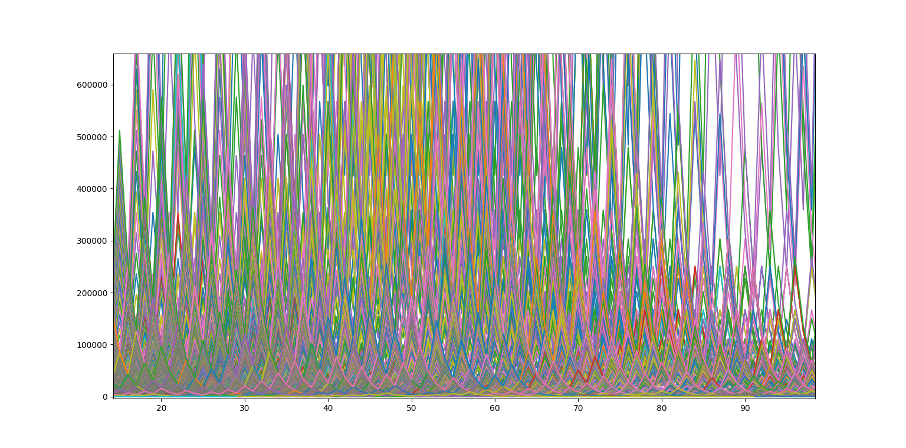

# Collatz Conjecture

In 1937, the German mathematician **Lothar Collatz** stumped the world with a peculiar observation in algebra. It was a seemingly simple phenomenon but no amount of logic couldn't explain why it played out the way it did. The simple observation stated that **every number would eventually lead to 1 when repeatedly halved (if even) and tripled and incremented by 1 (if odd)**. To put it in mathematical notation:

```{math}
collatz(x) = x/2 if x (mod 2) = 0
           = 3x + 1 if x (mod 2) = 1
```
This came to be known as the **Collatz Conjecture**. For years, scientists and mathematicians tried to figure out why this pattern kept repeating but no one could. It is still referred to as one of the simplest problems we could never solved. I have written a program that maps out how the algorithm outputs chains of numbers and another which draws a procedural tree using only the Collatz conjecture.

The java file **Collatz.java** outputs lists for every number from 1 to 10,000 showing the expected results: that regardless of what the number is, with the application of the same steps over and over again, it will reduce to 1. The given function takes an input of any integer and outputs a list of numbers calculated by applying the algorithm to them:

~~~java
public static int collatz(int number){
  series.add(number);
  if(number != 1){
    if(number%2 == 0){
      number = number/2;
      collatz(number);
    }else if(number%2 == 1){
      number = 3*number + 1;
      collatz(number);
    }
  }
return 0;
}
~~~

**Collatz.java** calculates the collatz series for all numbers between 1 and 10,000. All the series, as predicted, come down to [..., 4, 2, 1] at which point they start looping between the last three numbers but the code eliminates this loop with an if statement.

The python file **collatz.py** presents a graphical representation of how the algorithm looks on the selected numbers. Using the **matplotlib** library, the program graphs out the series using the following piece of code:

~~~python
def graph(number):
    collatz(number)
    for i in range(len(series)):
        xaxis.append(i)
    plt.plot(xaxis, series)

#some more code
plt.show()
~~~


The graph above shows how the numbers behave, and as predicted they all fall back to 1 regardless of where they start. A better example of this can be seen in the zoomed in version of the graph here:



The main part of this project is to procedurally generate a pattern using only the collatz conjecture. The file **collatz_draw.py** shows a glimpse of this process by using the **turtle** in python to chart out an instance of what the actual pattern should look like:

~~~python
def draw(series):
    count = 0
    for number in series:
        if number%2 == 0:
            turt.right(15)
            turt.forward(20)
        else:
            turt.left(15)
            turt.forward(20)
        count+=1
    turt.penup()
    turt.goto(-300, -300)
    turt.setheading(0)
    turt.pendown()

#some more code
turtle.done()
~~~

The output of this file looks like this:


For the actual execution of the pattern, I have used java and the software known as **processing3** (a visual java software) to make an aesthetic design derived from the algorithm. The **[collatz_processing.pde](https://processing.org/)** file does the job of drawing the infamous horse-tail pattern derived from the collatz conjecture.

It uses the **setup()** function to make an environment for the drawing:

~~~java
void setup(){
  noLoop();
  beginRecord(PDF, "wallpaper.pdf");
  fullScreen();
  background(29, 27, 27);
  stroke(236, 77, 55, 2);
  strokeWeight(2);
  translate(height, width/2);
}
~~~

It uses the **draw()** function to generate the image:

~~~java
void draw(){
  translate(height, width/2);
  for(int i = 1; i <= 10000; i++){
    collatz(i);
    Collections.reverse(series);
    //Iterator j = series.iterator();
    //(Integer)j.next()
    for(int j = 0; j < series.size(); j++){
      if(isEven(series.get(j))){
        rotate(0.12);
        line(0,0,0,-lin);
        translate(0, -lin);
      }else{
        rotate(-0.12);
        line(0,0,0,-lin);
        translate(0, -lin);
      }
    }
    resetMatrix();
    series.removeAll(series);
    translate(height, width/2);
  }
  endRecord();
}
~~~

After executing this file, a final image of the procedural is generated, which looks like this:


**A few other screenshots have been attached in the Assets folder**

**collatz_processing.pde** also creates a PDF called **wallpaper.pdf** containing the procedurally generated drawing.

Steps to run the code:

**Collatz.java:**
~~~java
javac Collatz.java
java Collatz
~~~

**collatz.py**
~~~python
python collatz.py
~~~

**collatz_draw.py**
~~~python
python collatz_draw.py
~~~

**collatz_processing.pde**
~~~java
//This file can only be executed in processing3, hence the software must be installed here
~~~
